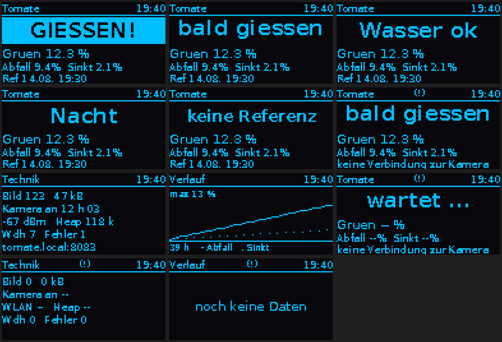

# Der Tomaten-Bewässerungswächter: bildgestützte Welke-Erkennung mit ESP32-CAM und Raspberry Pi

Prof. Dr.-Ing. Ralph Wystup M.Sc. — erstellt mit KI und Agent (Claude Code, Anthropic)

**Seite öffnen:** https://ralphwystup.github.io/Tomatenwaechter-Bildgestuetzte-Welkeerkennung-mit-ESP32-CAM-und-Raspberry-Pi/ — die Auswertung des Wächters im Browser an einer gezeichneten Pflanze (Excess-Green-Maske,
Grünfläche, Schwerpunkt, Referenz, Ampel), die drei Seiten des Displays, ein Tag im Zeitraffer mit Solarabschaltung, und die
drei Manuskripte samt Anleitungen als Dokumentation in der Seite. Läuft offline.

Eine solarbetriebene ESP32-CAM fotografiert alle fünf Minuten eine Tomatenpflanze. Ein Raspberry Pi holt das Bild blockweise
über Modbus TCP, trennt die Pflanze mit dem Excess-Green-Index (2G − R − B) vom Hintergrund und vergleicht Grünfläche und
Schwerpunkt mit der Referenz nach dem Gießen: hängen die Blätter, schaltet die Ampel auf GELB und ROT. Ein Display
(SSD1306, eigener Treiber ohne Fremdbibliothek) zeigt die Antwort, eine RS485-Klemmenebene kann gießen. Die Kamera wird
von der Solarversorgung regelmäßig stromlos; der Wächter erkennt den Neustart und stempelt die Zeit selbst ins Bild.

## Was drin ist

| Datei | Inhalt |
|:--|:--|
| [`Tomatenwaechter_1.0.html`](Tomatenwaechter_1.0.html) | Simulation, Display, Tag im Zeitraffer, Dokumentation |
| [`MANUSKRIPT_Tomatenwaechter.pdf`](MANUSKRIPT_Tomatenwaechter.pdf) | Band 1: Verfahren, Registerplan und Blockübertragung, Namensauflösung, Solar-Wiederanlauf, Bildauswertung mit Formeln, Bedienung |
| [`MANUSKRIPT_Tomatenwaechter_Pi.pdf`](MANUSKRIPT_Tomatenwaechter_Pi.pdf) | Band 2: vom PC-Programm zum Gerät — Raspberry Pi, OLED-Treiber mit Bitpackformel und 64-Punkt-Layout, RS485/Modbus RTU |
| [`MANUSKRIPT_Tomatenwaechter_Betrieb.pdf`](MANUSKRIPT_Tomatenwaechter_Betrieb.pdf) | Band 3: Regenschutz-Optik, Bildaufbereitung, Stromversorgung mit `get_throttled`-Bittabelle |
| [`ANLEITUNG_Pi_OLED.pdf`](ANLEITUNG_Pi_OLED.pdf), [`ANLEITUNG_Livekamera_USB.pdf`](ANLEITUNG_Livekamera_USB.pdf) | Arbeitsanleitungen: Aufbau, Installation, Betrieb, Fehlersuche, Wiederaufbau; Umgebungskamera |
| `pi/` | die Programme des Raspberry Pi: `pflanzen_dashboard.py` (Bildabholung, Auswertung, Webseite, Display, Klemmenebene), `oled_anzeige.py`, `waveshare_io.py`, `livecam.py`, Systemdienst, Einrichtungsskript |
| `kamera/ESP32_CAM_Modbus_Snapshot.ino` | Sketch der ESP32-CAM: Blockübertragung über Modbus-Register, Statusregister, OTA; Netzzugang eintragen |
| `test/` | Prüfprogramme für den RS485-Wandler und das Ein-/Ausgabemodul |
| `seite/`, `bilder/` | Erzeuger und Prüfmittel der Seite, Bilder |
| `index.html` | leitet auf die Seite weiter, damit GitHub Pages sie unter der Adresse oben zeigt |

Alle Netzadressen, Netznamen und Kennwörter des Aufbaus sind in dieser Veröffentlichung durch Platzhalter ersetzt.

## Lizenz

MIT, siehe [LICENSE](LICENSE).
